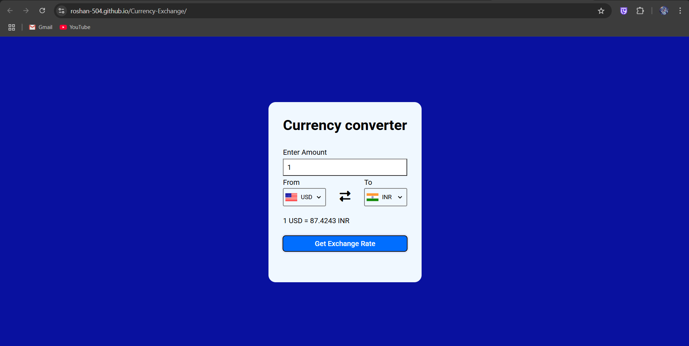

# 💱 Currency Exchange Converter

A simple, intuitive, and responsive web app for converting currencies in real-time using the [ExchangeRate API](https://www.exchangerate-api.com/). The app dynamically fetches current exchange rates and updates the UI with flag icons, selected currencies, and converted values.

---

## 🌐 Live Demo

[🔗 View Project](https://roshan-504.github.io/Currency-Exchange/)

---

## 📌 Features

- 🌍 **Real-Time Exchange Rates** using API calls
- 🇺🇸 **Auto Flag Detection** based on selected currency
- 🔁 **Swappable Currency Fields** (From & To)
- 📊 **Dynamic Currency List** (All global currencies)
- 🧮 **Live Calculations** based on input amount
- 💡 **User-Friendly UI** with icons and clear layout
- ⚡ **No Refresh Required** – all changes are reactive

---

## 🛠️ Tech Stack

| Area        | Technology                          |
|-------------|-------------------------------------|
| Frontend    | HTML5, CSS3, JavaScript (Vanilla)   |
| API         | [ExchangeRate-API](https://www.exchangerate-api.com/) |
| Flags       | [FlagsAPI](https://flagsapi.com/)   |

---

## 🚀 How to Run Locally

1. **Clone the Repository:**
   ```bash
   git clone https://github.com/Roshan-504/Currency-Exchange.git
   cd Currency-Exchange
   ```

2. **Open `index.html` in your browser:**
   No build tools or servers required – this is a pure frontend app!

---

## 📷 Screenshot


